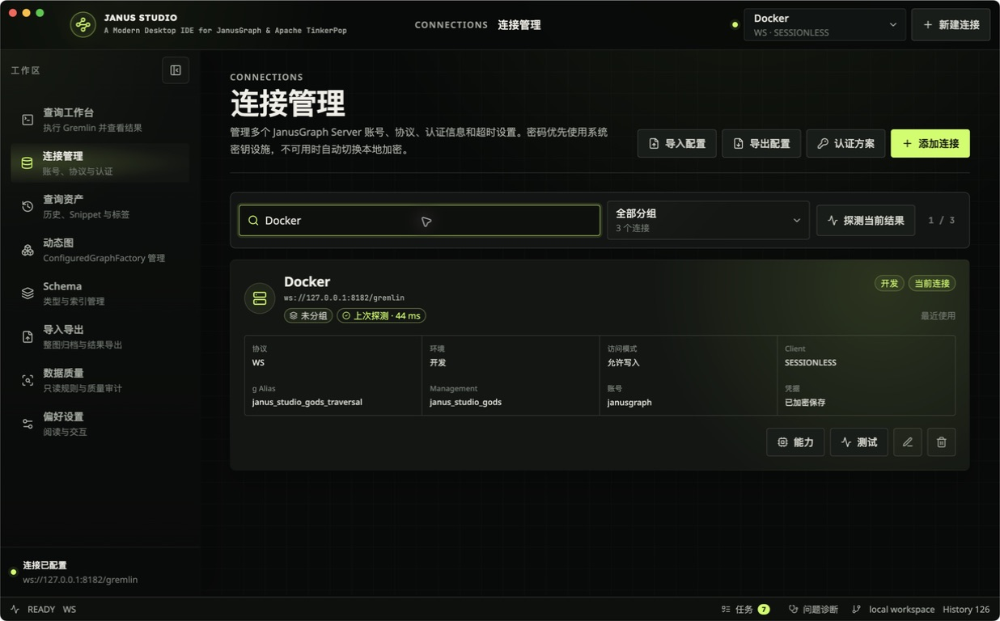
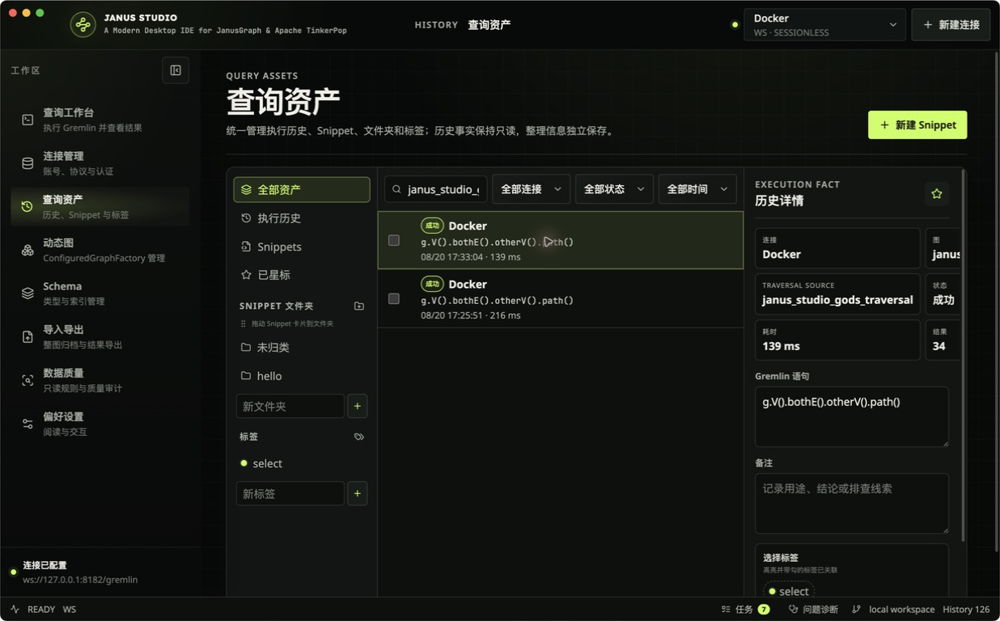
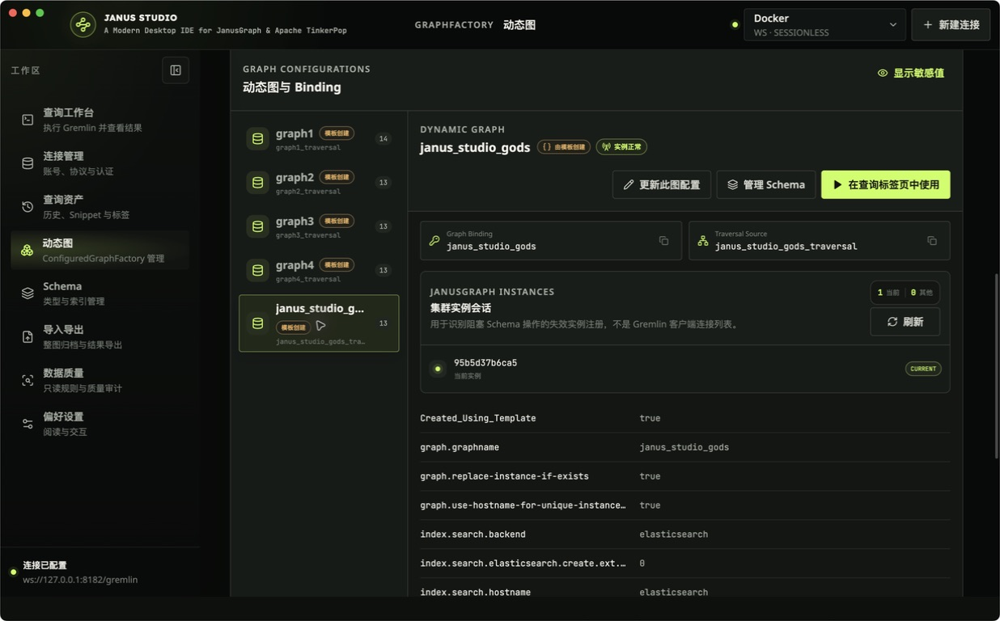
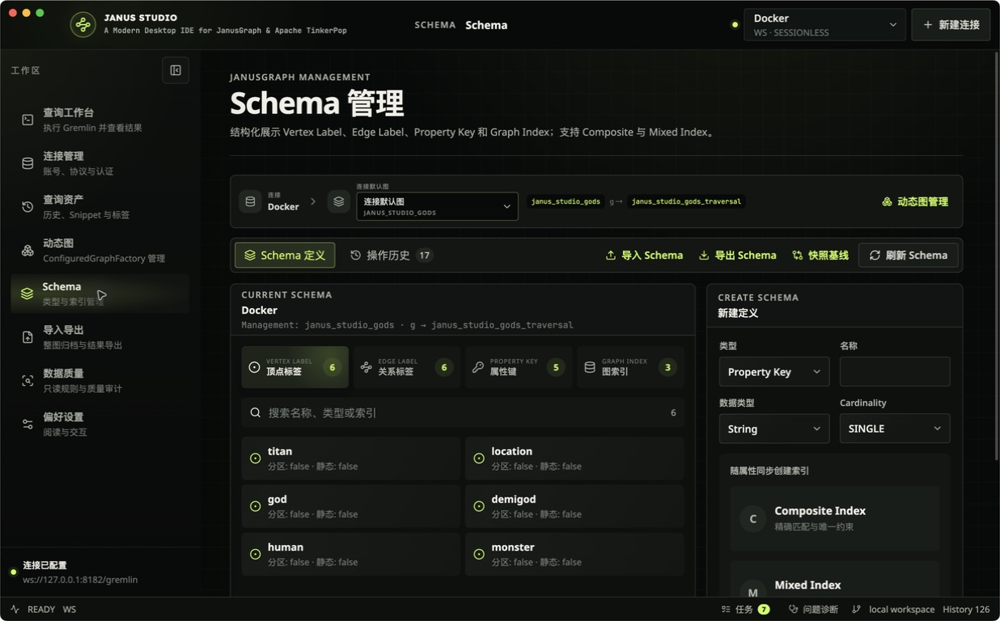
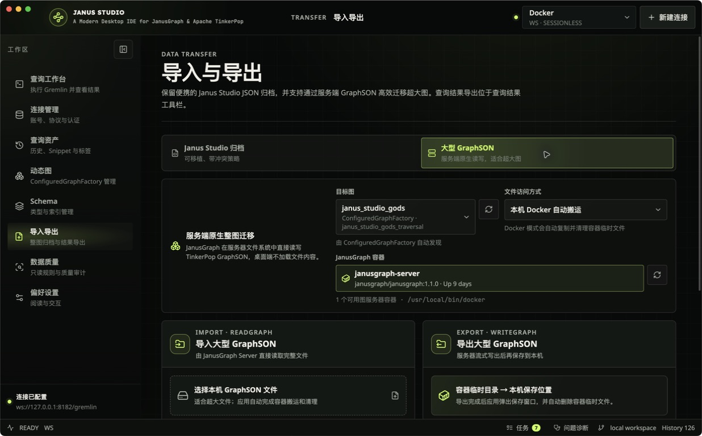
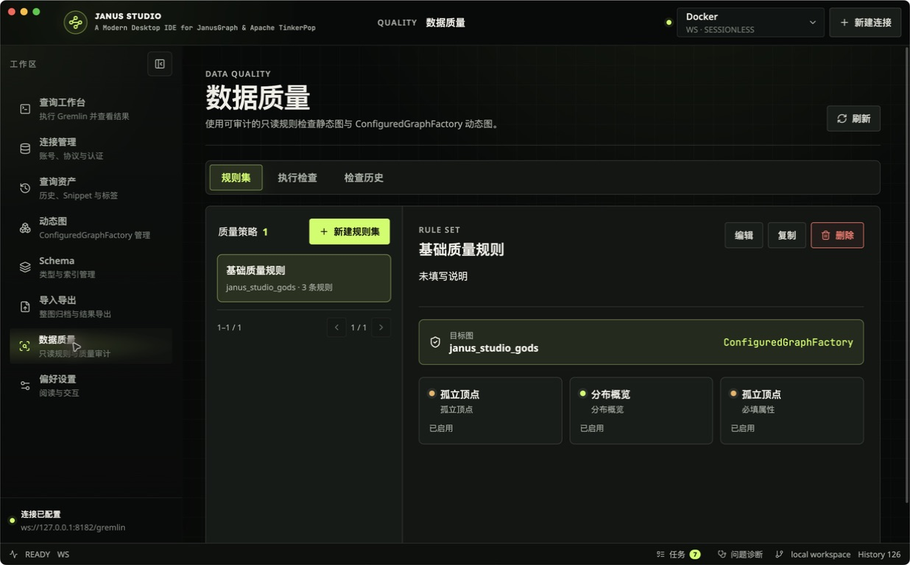
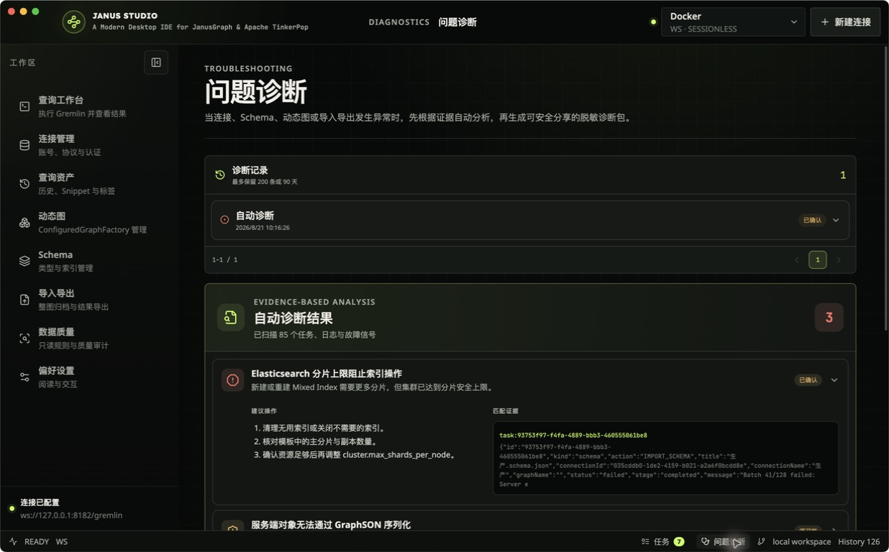

<div align="center">

# Janus Studio

**A Modern Desktop IDE for JanusGraph & Apache TinkerPop**

[English](README.md) · [简体中文](README.zh-CN.md)


</div>

Janus Studio is a cross-platform desktop workbench for connecting to,
querying, visualizing, and managing JanusGraph and Apache TinkerPop-compatible
graph databases. It combines a Gremlin-aware editor, multiple result views,
interactive graph exploration, schema tools, and local workspace persistence in
one native desktop application.

> [!NOTE]
> The application does not include a bundled graph database or sample data. A
> reachable JanusGraph or TinkerPop-compatible server is required for live use.

## Highlights

- **Connection management** — Manage multiple WS, WSS, HTTP, and HTTPS
  connections with authentication, TLS, custom headers, traversal sources, and
  sessionless or sessioned clients.
- **Gremlin workspace** — Use a Monaco-based editor with Gremlin highlighting,
  schema-aware completion, formatting, query tabs, parameter bindings,
  favorites, Explain, Profile, transactions, and configurable shortcuts.
- **Purpose-built result views** — Inspect results as an interactive topology,
  virtualized table, structured JSON, Gremlin console output, or raw response.
- **Graph visualization** — Explore force-directed, hierarchical, radial, and
  grid layouts; inspect element properties; save layouts; and export PNG, JPG,
  SVG, or JSON.
- **Schema and data tools** — Browse and manage labels, property keys, composite
  and mixed indexes, schema snapshots and diffs, safe additive schema
  imports/exports, whole-graph archives, and query-result exports.
- **Data quality audits** — Define reusable, schema-aware rule sets, run bounded
  or full read-only checks, inspect issue samples, and export complete CSV,
  JSONL, JSON, or business-readable audit reports.
- **Desktop-first experience** — Restore workspaces across restarts, search
  SQLite-backed history, choose from 14 interface languages, and customize
  themes, fonts, density, graph rendering, and shortcuts.
- **Credential protection** — Use a current-user-only AES-256-GCM vault on
  macOS; prefer operating-system key facilities on Windows and Linux with an
  encrypted local fallback.

## Screenshots

Every graph-aware screenshot uses `janus_studio_gods`, a dynamic graph created
through `ConfiguredGraphFactory` and initialized with JanusGraph's Graph of the
Gods example (12 vertices and 17 edges). The complete gallery was recaptured
from the same packaged macOS build connected to a local Docker environment;
credentials are not shown.

<table>
  <tr>
    <td width="50%"><strong>Gremlin query workbench</strong><br /></td>
    <td width="50%"><strong>Connection management</strong><br /></td>
  </tr>
  <tr>
    <td width="50%"><strong>Query assets</strong><br /></td>
    <td width="50%"><strong>ConfiguredGraphFactory</strong><br /></td>
  </tr>
  <tr>
    <td width="50%"><strong>Schema management</strong><br /></td>
    <td width="50%"><strong>Whole-graph import and export</strong><br /></td>
  </tr>
  <tr>
    <td width="50%"><strong>Data quality audits</strong><br /></td>
    <td width="50%"><strong>Troubleshooting</strong><br /></td>
  </tr>
  <tr>
    <td width="50%"><strong>Preferences</strong><br /></td>
    <td width="50%"></td>
  </tr>
</table>

## Platform support

| Platform | CI target | Package |
| --- | --- | --- |
| macOS | Apple Silicon (arm64) | ZIP application bundle |
| Windows | x64 | Squirrel installer |
| Linux | x64 | DEB and RPM packages |

Compatibility tests cover JanusGraph 1.1.0 and 1.0.0 over WebSocket, sessioned
WebSocket, and HTTP transports.

## Install a release

Download the package for your platform from the
[latest GitHub release](../../releases/latest). Release builds may be unsigned
unless the maintainers have configured the platform signing credentials. Your
operating system can therefore display a warning for development or test
artifacts.

## Run from source

### Prerequisites

- Node.js 22.x (the repository pins `22.17.0` in `.nvmrc`)
- pnpm 8.11.0
- Git

### Development

```bash
git clone <repository-url>
cd janus-studio
pnpm install
pnpm dev
```

If Electron downloads are slow on your network, set a mirror for the individual
command without changing the project configuration:

```bash
ELECTRON_MIRROR=https://npmmirror.com/mirrors/electron/ pnpm install
```

## Build and verify

```bash
# Generate localized message catalogs after changing user-visible UI text
pnpm i18n:generate

# Type-check every workspace package
pnpm typecheck

# Run unit and integration tests
pnpm test

# Create an unpacked application for the current platform
pnpm build

# Create distributable packages for the current platform
pnpm make
```

Four live JanusGraph integration tests are skipped when their environment is not
configured. The regular test suite does not require a real database connection.

## Project structure

```text
apps/desktop/
  src/main/             Electron main process, IPC, clients, and file operations
  src/preload/          Secure renderer API bridge
  src/renderer/         React UI, Gremlin editor, graph canvas, and settings
packages/domain/        Domain models and desktop API contracts
packages/application/   Framework-independent application rules and transforms
tests/                  Unit, integration, compatibility, and packaged-app tests
docs/                   Architecture and release documentation
design-system/          Visual system and page-specific rules
```

The three workspace packages are layers of one product, not separate apps:

- `@janusgraph/domain` defines framework-independent models and the shared
  desktop API contract.
- `@janusgraph/application` contains reusable, testable application rules and
  depends only on `domain`.
- `@janusgraph/desktop` is the Electron application and depends on both inner
  layers.

Dependencies point inward: `domain ← application ← desktop`. See the
[contributing guide](CONTRIBUTING.md#why-there-are-three-workspaces) for package
boundaries and examples of where changes belong.

The workspace uses Electron Forge, Vite, React, TypeScript, Monaco Editor,
Lucide, the official Gremlin JavaScript driver, and SQLite-backed local storage.

## Usage notes

### Sessioned transactions

Cross-query transactions require a WS/WSS connection configured in **Sessioned**
mode. Open a transaction from the query tab, then commit or roll it back from the
same tab. Sessionless and HTTP(S) requests cannot preserve a transaction across
queries.

### Data migration

Janus Studio archives split and process graph data in batches without requiring
users to divide files manually. Server-side GraphSON transfer is available for
large graphs and long-running migrations. For production-scale loading, review
JanusGraph batch-loading, Hadoop/ETL, and cluster resource limits before running
the job.

### Credentials

Never include passwords, encryption keys, or complete authentication headers in
bug reports. If a credential created by an older build can no longer be
decrypted, edit the connection and enter its password again to migrate it to the
current credential format.

## Documentation

- [Requirements and architecture (Chinese)](docs/需求分析与架构设计.md)
- [Design system](design-system/janusgraph-desktop/MASTER.md)
- [Workbench design rules](design-system/janusgraph-desktop/pages/workbench.md)
- [Release, signing, and updates (Chinese)](docs/发布与签名.md)
- [Contributing guide](CONTRIBUTING.md)

## Contributing

Issues and pull requests are welcome. Read [CONTRIBUTING.md](CONTRIBUTING.md) for
workspace boundaries, development workflow, project invariants, verification,
commit style, and the pull request checklist. A
[Simplified Chinese version](CONTRIBUTING.zh-CN.md) is also available.

## License

Licensed under the [GNU Affero General Public License v3.0 only](LICENSE).
