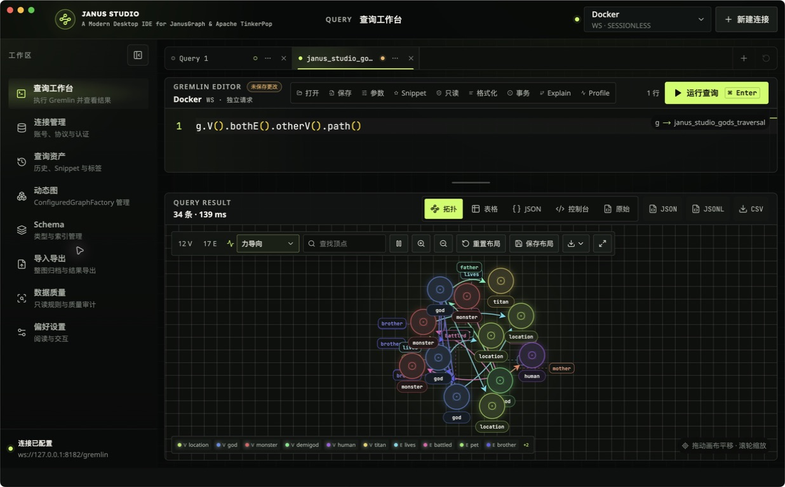
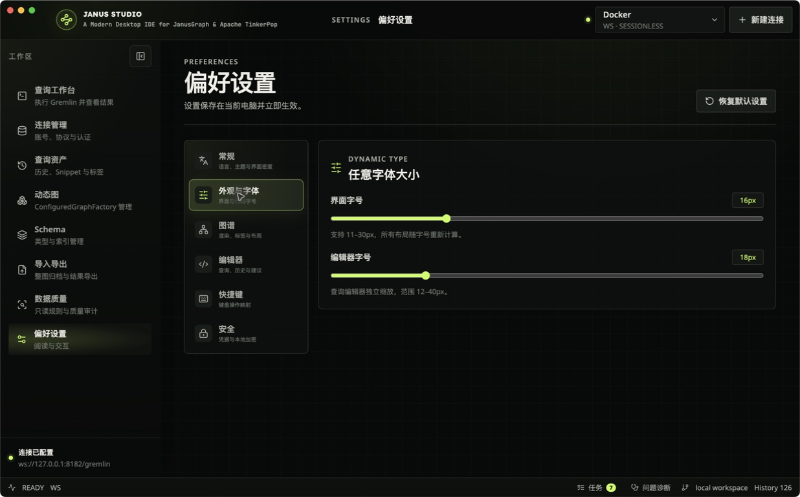

<div align="center">

# Janus Studio

**面向 JanusGraph 与 Apache TinkerPop 的现代桌面 IDE**

[English](README.md) · [简体中文](README.zh-CN.md)


</div>

Janus Studio 是一款跨平台桌面工作台，用于连接、查询、可视化和管理
JanusGraph 及兼容 Apache TinkerPop 的图数据库。它将 Gremlin 智能编辑器、多种结果视图、
交互式图谱探索、Schema 工具和本地工作区持久化整合到一个原生桌面应用中。

> [!NOTE]
> 应用不内置图数据库或示例数据。使用真实功能时，需要能够访问 JanusGraph 或兼容
> TinkerPop 的服务器。

## 核心特性

- **连接管理** — 管理多个 WS、WSS、HTTP 和 HTTPS 连接，支持认证、TLS、自定义
  Headers、Traversal Source、Sessionless 和 Sessioned 客户端。
- **Gremlin 工作区** — 基于 Monaco 的编辑器提供 Gremlin 高亮、Schema 感知补全、格式化、
  查询标签页、参数绑定、收藏、Explain、Profile、事务和可配置快捷键。
- **多种结果视图** — 使用交互式拓扑图、虚拟滚动表格、结构化 JSON、Gremlin Console
  或原始响应查看查询结果。
- **图谱可视化** — 支持力导向、层级、径向和网格布局，可检查元素属性、保存布局，并导出
  PNG、JPG、SVG 或 JSON。
- **Schema 与数据工具** — 浏览和管理 Label、Property Key、Composite/Mixed Index、
  Schema 快照与差异、安全的增量 Schema 导入导出、整图归档和查询结果导出。
- **数据质量检查** — 创建可复用、Schema 感知的规则集，执行有界或全量只读检查，
  查看问题样本，并导出完整 CSV、JSONL、JSON 或面向业务阅读的审计报告。
- **桌面端体验** — 跨重启恢复工作区、搜索 SQLite 查询历史、选择 14 种界面语言，并自定义
  主题、字体、密度、图谱渲染和快捷键。
- **凭据保护** — macOS 使用仅限当前用户访问的 AES-256-GCM 本地凭据库；Windows 和
  Linux 优先使用系统密钥设施，不可用时回退到本地加密存储。

## 应用截图

**Gremlin 查询工作台**



**偏好设置**



## 平台支持

| 平台 | CI 目标 | 制品格式 |
| --- | --- | --- |
| macOS | Apple Silicon（arm64） | ZIP 应用包 |
| Windows | x64 | Squirrel 安装包 |
| Linux | x64 | DEB 和 RPM 软件包 |

兼容性测试覆盖 JanusGraph 1.1.0 与 1.0.0，以及 WebSocket、Sessioned WebSocket
和 HTTP 三类传输方式。

## 安装发行版

前往 [GitHub 最新发行版](../../releases/latest) 下载对应平台的安装包。如果维护者尚未配置
平台签名凭据，发行制品可能没有正式签名，操作系统可能会对开发或测试制品显示安全提示。

## 从源码运行

### 环境要求

- Node.js 22.x（仓库通过 `.nvmrc` 固定为 `22.17.0`）
- pnpm 8.11.0
- Git

### 开发模式

```bash
git clone <repository-url>
cd janusgraph-desktop-manager
pnpm install
pnpm dev
```

如果当前网络下载 Electron 较慢，可仅为单次命令指定镜像，不修改项目配置：

```bash
ELECTRON_MIRROR=https://npmmirror.com/mirrors/electron/ pnpm install
```

## 构建与验证

```bash
# 修改用户可见界面文字后生成多语言消息目录
pnpm i18n:generate

# 检查所有 workspace 包的 TypeScript 类型
pnpm typecheck

# 运行单元测试与集成测试
pnpm test

# 构建当前平台的未封装应用
pnpm build

# 生成当前平台的可分发制品
pnpm make
```

未配置真实 JanusGraph 环境时，4 项在线集成测试会自动跳过。常规测试不需要连接真实数据库。

## 项目结构

```text
apps/desktop/
  src/main/             Electron 主进程、IPC、客户端与文件操作
  src/preload/          安全的渲染进程 API 桥接
  src/renderer/         React UI、Gremlin 编辑器、图画布与设置
packages/domain/        领域模型与桌面 API 契约
packages/application/   与框架无关的应用规则和数据转换
tests/                  单元、集成、兼容和打包应用测试
docs/                   架构与发布文档
design-system/          视觉系统与页面规则
```

三个 workspace 是同一产品的架构分层，不是三个独立应用：

- `@janusgraph/domain` 定义与框架无关的领域模型和共享桌面 API 契约。
- `@janusgraph/application` 存放可复用、可独立测试的应用规则，只依赖 `domain`。
- `@janusgraph/desktop` 是实际 Electron 应用，依赖前面两个内层 workspace。

依赖方向固定为 `domain ← application ← desktop`。代码应该放在哪一层及具体边界请参阅
[贡献指南](CONTRIBUTING.zh-CN.md#为什么有三个-workspace)。

项目主要使用 Electron Forge、Vite、React、TypeScript、Monaco Editor、Lucide、
官方 Gremlin JavaScript Driver 和基于 SQLite 的本地存储。

## 使用说明

### Sessioned 事务

跨查询事务只适用于配置为 **Sessioned** 模式的 WS/WSS 连接。在查询标签页开启事务后，
需要在同一标签页中提交或回滚。Sessionless 和 HTTP(S) 请求无法跨查询保留事务。

### 数据迁移

整图导入导出面向中小规模迁移，单个归档上限为 200 MB。生产级或超大规模迁移应使用
JanusGraph Bulk Loading、Hadoop/ETL 或集群侧作业。

### 凭据安全

提交问题时，请勿附带密码、加密密钥或完整认证 Header。如果旧版本创建的凭据无法继续解密，
请编辑对应连接并重新输入密码，将其迁移到当前凭据格式。

## 文档

- [需求分析与架构设计](docs/需求分析与架构设计.md)
- [设计系统](design-system/janusgraph-desktop/MASTER.md)
- [工作台设计规则](design-system/janusgraph-desktop/pages/workbench.md)
- [发布、签名与自动更新](docs/发布与签名.md)
- [参与贡献指南](CONTRIBUTING.zh-CN.md)

## 参与贡献

欢迎提交 Issue 和 Pull Request。请先阅读 [CONTRIBUTING.zh-CN.md](CONTRIBUTING.zh-CN.md)，
其中包含 workspace 边界、开发流程、项目不变量、验证要求、Commit 格式和 Pull Request
检查清单；同时提供 [英文版](CONTRIBUTING.md)。

## 开源协议

本项目采用 [GNU Affero General Public License v3.0 only](LICENSE) 开源。
