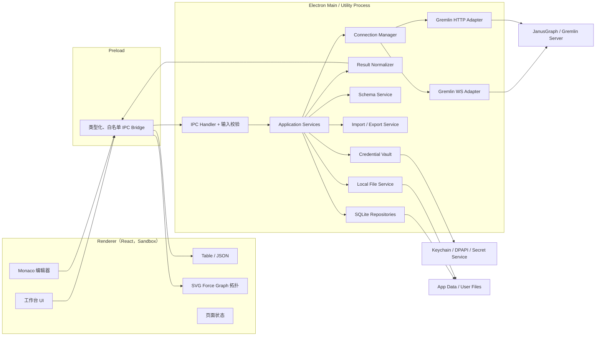
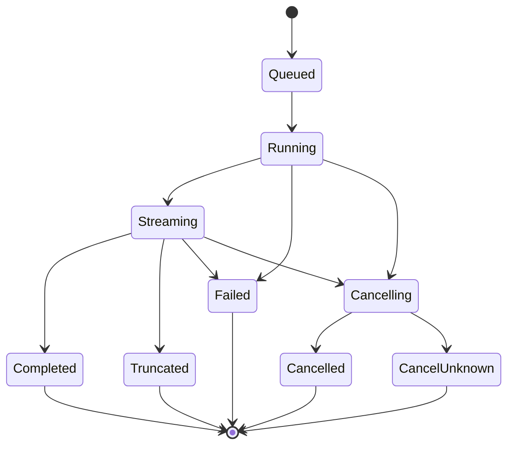
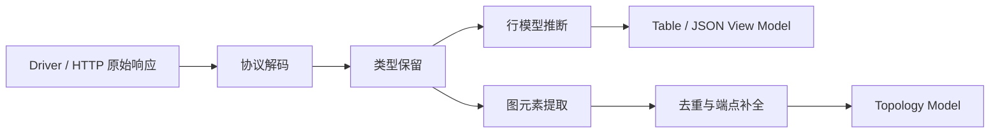

# JanusGraph Desktop 需求分析与架构设计

> 文档状态：Implemented Baseline v2.0
> 更新日期：2026-08-03
> 目标平台：macOS、Windows、Linux

## 1. 结论摘要

建议将产品定位为“面向开发、排障和轻量运维的 JanusGraph 桌面工作台”，而不是只提供一个 Gremlin 输入框。

首选技术路线：

- 桌面容器：Electron
- 主要语言：TypeScript
- UI：React + Vite
- 编辑器：Monaco Editor
- 图可视化：React + SVG 自研物理力导向引擎（支持多布局与自由拖动）
- 表格：TanStack Table + 虚拟滚动
- 本地数据：SQLite
- 凭据保护：Electron `safeStorage` + 操作系统密钥设施
- WebSocket：与目标 JanusGraph/TinkerPop 版本匹配的官方 `gremlin-javascript` 驱动
- HTTP：主进程内的 `fetch` 适配器
- 打包与发布：Electron Forge，CI 在三个操作系统上分别构建

当前代码已经完成可运行基线，而非静态原型：连接、查询、历史、Schema、拓扑、设置、整图迁移均由 Electron IPC、SQLite、本地文件系统或真实 JanusGraph 请求驱动。Renderer 不包含演示连接或默认图数据。

### 1.1 当前实现状态（2026-08-03）

| 模块 | 已实现基线 |
|---|---|
| 连接 | 多配置、WS/WSS/HTTP/HTTPS、Sessionless/Sessioned、密码安全存储与迁移回退、Traversal Source/Graph Binding、TLS、压缩、自定义 Headers、测试与分阶段错误 |
| 编辑器 | Monaco、语法高亮、行号、折叠、括号、查找替换、选择执行、停止、服务端行列诊断、参数绑定、只读保护、脚本文件、收藏、多标签管理与恢复、跨平台快捷键 |
| 结果 | JSON、虚拟化 Data Grid、拓扑；Data Grid 支持排序/筛选/列管理/键盘导航/复制/详情；查询结果 JSON/JSONL/CSV 导出 |
| 拓扑 | Label 自动分色、物理力导向、层级/环形/网格、节点与曲线拖动、画布平移缩放、全屏、详情、邻居展开、搜索、图例、布局持久化、SVG 导出 |
| Schema | Vertex Label、Edge Label、Property Key、Graph Index 结构化查看；C/M 索引随属性创建；索引生命周期；Schema 快照差异 |
| 数据迁移 | Observatory v1 整图 JSON，预览、可配置批次、批后停止、失败继续与日志、来源 ID 冲突策略；200 MB 本地文件保护 |
| 设置 | 主题、14 种 Locale、界面/代码字体与自定义字体、11–30px 字号、密度、标签字段、拓扑数量与物理参数、多布局、标签页布局、快捷键冲突检测 |

仍保持明确边界：桌面端不承担 TB 级迁移；代理/SSH Tunnel、企业证书文件、服务端长任务 Job 监控属于后续基础设施扩展，不应伪装为已实现能力。

选择 Electron 的核心原因不是“跨平台”这一项本身，而是它最适合本项目的协议和交互组合：

1. 官方 Gremlin JavaScript 驱动原生运行在 Node.js 环境，放在 Electron 主进程中最直接。
2. WebSocket/SASL、HTTP Basic Auth、TLS、自定义请求头、代理和证书处理都可集中在主进程，不受浏览器 CORS 限制。
3. Monaco、SVG/Canvas 图渲染和大数据表格生态成熟。
4. 当前电脑已有 Node.js 22、npm、pnpm 和 Xcode，能够立即启动 Electron 开发；Tauri 所需 Rust 尚未安装。
5. 单一 TypeScript 技术栈便于快速交付 MVP，并降低协议层和 UI 层之间的协作成本。

需要从第一天就正视三项边界：

- JanusGraph 与 TinkerPop 驱动必须按兼容矩阵匹配。JanusGraph 1.1.0 官方测试的是 TinkerPop 3.7.3，不能默认使用当前最新的 3.8.x 驱动。
- Schema 管理依赖 JanusGraph Management API。远程使用时通常要提交服务器端脚本，普通 Gremlin bytecode 无法覆盖全部 Management API。
- 任意 Gremlin 结果不一定天然构成拓扑图。客户端只能自动识别 Vertex、Edge、Path 以及约定结构；标量、聚合 Map 等结果需要表格/JSON 展示或显式映射。

## 2. 背景与产品目标

### 2.1 目标用户

- 使用 JanusGraph 的应用开发者
- 数据建模与图算法工程师
- 测试、运维和故障排查人员
- 需要查看图数据但不熟悉 Gremlin Console 的业务技术人员

### 2.2 核心目标

- 管理多个 JanusGraph 连接配置并快速切换。
- 安全、稳定地执行 Gremlin 查询，清楚展示返回值、耗时、数量和错误。
- 将可识别的图结果转换为可交互拓扑图。
- 提供历史记录、收藏、查询片段和基础 Gremlin 补全。
- 提供受控的 Schema 查看和变更能力。
- 支持查询结果导出、小规模数据导入，以及对大规模迁移任务的引导。
- 在 macOS、Windows、Linux 上提供一致的核心体验。

### 2.3 非目标

以下内容不建议进入首个版本：

- 取代 Cassandra/HBase/Elasticsearch/Solr 的原生管理工具。
- 在桌面进程内完成 TB 级全图迁移、分布式重建索引或 OLAP 任务。
- 实现完整 Groovy IDE 或对任意 Groovy 脚本做可靠静态分析。
- 绕过 JanusGraph Server 的权限控制。
- 把数据库密码、查询结果或服务器响应上传到云端。
- 在客户端自动修改服务端 `gremlin-server.yaml`。

## 3. 已确认的技术事实与约束

### 3.1 协议能力

JanusGraph Server 基于 Gremlin Server，可配置：

- WebSocket
  - 支持字符串脚本。
  - 支持 Gremlin bytecode。
  - 认证通常使用 SASL。
- HTTP
  - 支持字符串脚本。
  - 可使用 Basic Auth；具体能力由服务端 Channelizer 和 Authenticator 配置决定。
- 同一端口同时提供 WS 与 HTTP
  - 服务端需要配置 `WsAndHttpChannelizer`。

产品中的“ws/http”应扩展为四种安全等级明确的协议：

- `ws://`
- `wss://`
- `http://`
- `https://`

生产连接创建时应主动提示优先使用 `wss://` 或 `https://`。

### 3.2 版本兼容

当前 JanusGraph 官方稳定文档为 1.1.0，其测试组合包含 TinkerPop 3.7.3。TinkerPop 当前版本已经进入 3.8.x，协议、语法和序列化细节仍会演进。

因此连接配置必须包含：

- JanusGraph 版本：自动探测失败时允许手动选择。
- TinkerPop 版本：自动探测失败时允许手动选择。
- 序列化器：默认自动，也可指定 GraphSON 版本。
- 脚本语言：默认 `gremlin-groovy`，未来可支持 `gremlin-lang`。
- Traversal Source：默认 `g`。
- Graph Binding：默认 `graph`，Schema 管理时使用。

驱动策略：

- MVP 以 JanusGraph 1.0/1.1 与 TinkerPop 3.7 系列为第一支持目标。
- 协议层通过 `CompatibilityProfile` 隔离，不让版本判断散落到 UI。
- 使用与服务端兼容的驱动版本，而不是盲目跟随 npm 最新版。
- 每个已验证组合进入自动化兼容矩阵。

### 3.3 返回数据与序列化

Gremlin 返回值可能包括：

- 标量：字符串、数字、布尔值、日期等。
- 集合：List、Set、Map。
- 图元素：Vertex、Edge、VertexProperty、Property。
- 路径：Path。
- JanusGraph 特有类型和谓词。
- 脚本自定义对象。

GraphSON 3 对 Map、List、Set 和非字符串 Map Key 有显式类型表达。不能只做普通 `JSON.parse` 后丢弃类型标记，否则顶点 ID、长整数、集合类型和复杂 Map Key 可能失真。

客户端内部需要保留两个视图：

- `rawValue`：尽可能保留驱动反序列化后的类型和值。
- `displayValue`：转换为可排序、可复制、可导出的安全展示结构。

### 3.4 Schema 管理限制

JanusGraph Management System 用于管理：

- Property Key
- Vertex Label
- Edge Label
- Graph Index
- Vertex-centric Index
- Consistency
- Index 状态和生命周期

Management API 具有事务语义，需要明确 `commit` 或 `rollback`。通过远程驱动访问时，通常需要提交运行在服务器 JVM 内的脚本，并要求：

- 服务端开启相应脚本引擎。
- JanusGraph 插件和类导入可用。
- `graph` Binding 可访问。
- 当前账号有执行管理脚本的权限。

索引操作不是简单 CRUD。创建、注册、重建、启用、禁用、丢弃和删除存在状态机；REINDEX 可能是长时间、高负载任务。

### 3.5 导入导出限制

必须区分三类能力：

1. 查询结果导出
   - 本地保存 JSON、JSONL、CSV。
   - 只导出当前结果或已接收的结果。
2. 小规模图数据导入导出
   - 客户端读取本地文件。
   - 分批生成参数化 Gremlin 写入。
   - 提供校验、预览、断点、失败明细和幂等键策略。
3. 大规模全图迁移
   - 应使用服务端/集群侧批处理、Hadoop/ETL 或专用作业。
   - 桌面端只负责生成任务配置、发起受支持的任务和监控，不承担全量数据管道。

`graph.io(...).writeGraph("/path")` 中的路径位于服务器文件系统，不是用户桌面电脑。产品界面必须明确标注，避免用户误以为文件会保存到本地。

## 4. 需求分析

### 4.1 功能优先级

采用：

- P0：首个可用版本必须具备。
- P1：形成完整产品体验所需。
- P2：增强能力。
- P3：远期或企业能力。

| 编号 | 模块 | 需求 | 优先级 |
|---|---|---|---|
| ACC-01 | 连接 | 添加、编辑、复制、删除连接配置 | P0 |
| ACC-02 | 连接 | WS/WSS、HTTP/HTTPS | P0 |
| ACC-03 | 连接 | 用户名、密码与连接测试 | P0 |
| ACC-04 | 连接 | Traversal Source、Graph Binding、超时、TLS | P0 |
| ACC-05 | 连接 | 分组、标签、颜色、最近连接 | P1 |
| ACC-06 | 连接 | 自定义 Headers、代理、SSH Tunnel | P2 |
| QRY-01 | 查询 | 多标签查询编辑器、执行、停止/逻辑取消 | P0 |
| QRY-02 | 查询 | 耗时、返回数量、状态、错误定位 | P0 |
| QRY-03 | 查询 | JSON 与表格展示 | P0 |
| QRY-04 | 查询 | 结果流式接收、虚拟滚动、结果上限 | P1 |
| QRY-05 | 查询 | 参数绑定、查询超时、只读保护 | P1 |
| QRY-06 | 查询 | explain/profile 快捷操作 | P2 |
| GRF-01 | 拓扑 | 从 Vertex/Edge/Path 构造拓扑 | P0 |
| GRF-02 | 拓扑 | 点击节点/边加载详情 | P0 |
| GRF-03 | 拓扑 | 布局切换、缩放、搜索、隐藏、固定 | P1 |
| GRF-04 | 拓扑 | 标签样式规则、属性映射、聚合折叠 | P1 |
| GRF-05 | 拓扑 | 邻居扩展、路径高亮、图片导出 | P2 |
| HIS-01 | 历史 | 自动记录查询、时间、连接、状态与耗时 | P0 |
| HIS-02 | 历史 | 搜索、筛选、重新执行、删除 | P0 |
| HIS-03 | 历史 | 收藏、命名查询、标签和工作区 | P1 |
| AUT-01 | 补全 | Gremlin step 名称补全和文档提示 | P1 |
| AUT-02 | 补全 | 基于 Schema 的 label/property 补全 | P1 |
| AUT-03 | 补全 | 按当前遍历上下文过滤下一 step | P2 |
| SCH-01 | Schema | 查看 Property Key、Vertex/Edge Label | P1 |
| SCH-02 | Schema | 创建基础 Schema | P1 |
| SCH-03 | Schema | 查看与管理 Graph/Vertex-centric Index | P1 |
| SCH-04 | Schema | 危险操作预览、确认、审计记录 | P1 |
| IMP-01 | 导出 | 查询结果导出 JSON/JSONL/CSV | P0 |
| IMP-02 | 导入 | CSV/JSONL 映射、预览、小批量写入 | P1 |
| IMP-03 | 数据 | 小规模图数据导出/导入 | P2 |
| IMP-04 | 数据 | 大规模外部作业生成与监控 | P3 |

### 4.2 多连接与账号管理

“账号”建议改称“连接配置”，因为一个配置不仅包含账号，还包含协议、地址、图绑定和兼容参数。

连接配置字段：

| 字段 | 必填 | 说明 |
|---|---:|---|
| 名称 | 是 | 用户可读名称，工作区内唯一 |
| 协议 | 是 | WS/WSS/HTTP/HTTPS |
| Host/Port/Path | 是 | 默认路径 `/gremlin`，HTTP 可留空或按服务端配置 |
| 用户名 | 否 | 由认证方式决定 |
| 密码 | 否 | 加密保存，也可选择“每次询问” |
| Traversal Source | 是 | 默认 `g` |
| Graph Binding | 否 | 默认 `graph` |
| 认证类型 | 是 | None、Username/Password；后续扩展 Header/Token |
| TLS 校验 | 是 | 默认严格校验；禁止全局关闭 |
| CA/Client Cert | 否 | 企业环境扩展 |
| 连接超时 | 是 | 建议默认 10 秒 |
| 查询超时 | 是 | 建议默认 30 秒 |
| 版本配置 | 是 | Auto 或明确的 JanusGraph/TinkerPop Profile |
| 默认结果上限 | 是 | 防止误查全图 |

连接测试应分阶段反馈：

1. URL 与协议校验。
2. DNS/TCP/TLS。
3. 认证。
4. 执行轻量查询，如 `g.V().limit(1).count()`。
5. 探测服务端版本和序列化能力。
6. 可选探测 Schema 管理权限。

删除连接时：

- 默认保留历史并将其连接标记为“已删除”。
- 用户可单独选择一并删除该连接的历史。
- 删除密码密文和内存中的活动连接。

### 4.3 查询工作台

建议布局：

- 左侧：连接、Schema、历史、收藏。
- 中间上方：多标签编辑器。
- 中间下方：结果区，包含 Table、JSON、Graph、Raw/Error。
- 右侧抽屉：节点/边详情、执行统计和查询设置。
- 底部状态栏：连接状态、协议、版本、耗时、接收条数。

执行语义：

- `Cmd/Ctrl + Enter`：执行选中内容；无选中时执行当前语句。
- `Cmd/Ctrl + Shift + Enter`：执行整个编辑器。
- 每个标签页绑定一个连接，切换连接时必须显式提示。
- 同一连接可并发查询，但配置最大并发数。
- 到达客户端结果上限后停止继续渲染，并明确提示“结果已截断”。
- 不应偷偷为用户改写原查询；可提供“建议添加 `.limit(n)`”。
- 对 `drop()`、`property()`、`addV()`、`addE()`、Schema 变更等写操作显示醒目标识。

取消的真实语义要区分：

- UI 取消：停止等待和渲染。
- 请求取消：协议/服务端支持时发送取消。
- 连接中断：必要时关闭该请求所在连接。
- 服务端执行是否已停止：不能保证时必须明确提示。

### 4.4 表格与 JSON 展示

表格规则：

- 标量列表：单列 `value`。
- 同构 Map：Map Key 作为列。
- Vertex/Edge：固定列展示 ID、Label、方向与属性。
- 异构数据：取字段并集，缺失值为空。
- 嵌套值：单元格摘要 + 展开详情。
- 支持列排序、过滤、固定、复制和导出。
- 使用虚拟滚动，不一次创建大量 DOM。

JSON 规则：

- 提供 Pretty、Compact 和 Typed 三种模式。
- Typed 模式保留 GraphSON 类型信息。
- 长整数默认以字符串安全显示，避免 JavaScript 精度丢失。
- 超大结果使用增量树或文本模式，避免完整 JSON 树造成内存峰值。
- 错误结果显示服务端 message、status code、attributes 和必要的 stack trace；默认折叠服务端内部堆栈。

### 4.5 拓扑图

#### 自动识别

以下结果可直接进入拓扑：

- Vertex
- Edge
- Path
- 包含上述对象的 List/Set/Map
- `elementMap()` / `valueMap(true)` 等可识别结构

无法直接拓扑化的例子：

- `g.V().count()`
- `g.V().groupCount().by(label)`
- 任意业务 Map 且没有顶点/边 ID 或方向字段

此时 Graph 标签页应说明原因，并提供可执行的查询建议，而不是展示空白画布。

#### 统一图模型

```ts
type GraphId = {
  type: string;
  value: string;
};

interface GraphNode {
  key: string;              // type + value 的稳定编码，仅供前端
  id: GraphId;              // 保留原始 ID 类型
  label: string;
  properties: Record<string, unknown>;
  sourceRowIds: string[];
}

interface GraphEdge {
  key: string;
  id: GraphId;
  label: string;
  outV: GraphId;
  inV: GraphId;
  properties: Record<string, unknown>;
  sourceRowIds: string[];
}
```

不能只用 `String(id)` 作为唯一键，否则数字 `1` 和字符串 `"1"` 会碰撞。

#### 元素详情

点击节点时使用参数绑定执行等价于：

```groovy
g.V(vertexId).elementMap()
```

点击边时执行等价于：

```groovy
g.E(edgeId).elementMap()
```

要求：

- ID 通过 bindings 传输，不能拼接进脚本文本。
- 详情查询使用当前标签页绑定的连接。
- 详情结果短期缓存；支持手动刷新。
- 元素已删除时显示“对象不存在”，不保留陈旧详情冒充实时结果。

#### 大图保护

- 默认只渲染前 1,000 个元素，阈值可配置。
- 超过阈值时提示筛选、抽样或聚合。
- 使用增量布局和批量更新。
- 停止布局与停止查询分开控制。
- 推荐首次实现 CoSE、Concentric、Grid 等本地布局；超大图布局放到 Worker。

### 4.6 历史、收藏与工作区

历史默认记录：

- 原始语句
- 参数的脱敏摘要
- 连接 ID 和连接快照名称
- 起止时间、耗时
- 成功/失败/取消/截断状态
- 返回条数
- 错误摘要
- 客户端版本

默认不永久保存完整查询结果，原因是：

- 可能包含敏感数据。
- 结果体积不可控。
- 数据很快过期。

用户可以显式保存结果快照，并看到预计大小和敏感数据提示。

历史提供：

- 全文搜索
- 按连接、时间、状态筛选
- 重新打开与重新执行
- 收藏/取消收藏
- 自定义名称和标签
- 清理策略：按天数、条数或磁盘大小

### 4.7 下一 Step 提醒

该能力可实现，但需要分级交付。

#### 第一级：词法补全（P1）

- 输入 `.` 后列出 Gremlin steps。
- 显示参数签名、简短说明和示例。
- 支持括号、字符串和常见枚举补全。
- 补全数据按 TinkerPop 兼容 Profile 版本化。

#### 第二级：Schema 感知补全（P1）

- `hasLabel(`、`V().hasLabel(`：提示 Vertex Label。
- `out(`、`in(`、`both(`：提示 Edge Label。
- `has(`、`values(`、`properties(`：提示 Property Key。
- Schema 缓存带连接 ID、版本号和更新时间，可手动刷新。

#### 第三级：上下文推断（P2）

解析当前 traversal 的输出类型，例如：

- `g.V()` 后优先提示适用于 Vertex 的 step。
- `outE()` 后优先提示 Edge 相关 step。
- `values()` 后降低图元素专用 step 的优先级。

边界：

- Gremlin Groovy 允许变量、闭包和任意脚本，无法做完整可靠的静态推断。
- 首版应明确支持“常见 traversal 链”，解析失败时退化为词法补全。
- 不应执行半成品语句来获得提示。

实现建议：

- Monaco Completion Provider。
- 一份版本化 step 元数据目录。
- 轻量 tokenizer/括号与 traversal 链解析器。
- 后续评估从 TinkerPop Gremlin grammar 生成 parser。
- Schema 元数据只从本地缓存读取，输入时不发网络请求。

### 4.8 Schema 管理

#### 查看

- Property Keys：名称、数据类型、基数。
- Vertex Labels：名称、是否分区、是否静态。
- Edge Labels：名称、方向、多重性、签名、排序键。
- Graph Index：名称、元素类型、字段、唯一性、后端、状态。
- Vertex-centric Index：所属类型、方向、排序、状态。

#### 变更

变更不应直接由 UI 拼接任意 Groovy。应采用：

1. UI 生成结构化 `SchemaCommand`。
2. 校验器检查命名、类型、依赖和当前状态。
3. 模板引擎生成已审查的参数化脚本。
4. 用户看到变更摘要和将执行的脚本。
5. 执行单个 Management Transaction。
6. 成功 commit，失败 rollback。
7. 刷新 Schema 缓存并写审计记录。

示例结构：

```ts
type SchemaCommand =
  | { kind: "createPropertyKey"; name: string; dataType: string; cardinality: string }
  | { kind: "createVertexLabel"; name: string }
  | { kind: "createEdgeLabel"; name: string; multiplicity: string }
  | { kind: "createCompositeIndex"; name: string; element: "Vertex" | "Edge"; keys: string[] };
```

#### 危险等级

| 等级 | 示例 | 交互 |
|---|---|---|
| 低 | 查看 Schema | 直接执行 |
| 中 | 创建 Key/Label | 显示摘要后确认 |
| 高 | 创建索引、REINDEX、DISABLE | 二次确认，显示影响 |
| 极高 | DISCARD/DROP Index、清图 | 输入对象名称确认，默认禁用 |

长任务不能用一个普通请求一直阻塞 UI。索引任务需要：

- 单独的 Jobs 页面。
- 状态轮询和日志。
- 离开页面后仍可恢复显示。
- 清楚区分“客户端停止监控”和“服务端任务停止”。

### 4.9 导入导出

#### 查询结果导出（P0）

- JSON：适合通用展示结构。
- Typed JSON/GraphSON：尽可能保留类型。
- JSONL：适合大结果流式写入。
- CSV：仅适合扁平表格；嵌套值需配置展开或 JSON 字符串化。

导出使用流式写文件，避免将一份大结果在内存中复制多次。

#### 小规模数据导入（P1）

向导步骤：

1. 选择 CSV/JSONL。
2. 采样与编码检测。
3. 选择 Vertex 或 Edge。
4. 映射 Label、ID、属性、类型。
5. Edge 映射起点和终点查找键。
6. 校验 Schema 与唯一索引。
7. 预览前 N 条将执行的操作。
8. 分批提交、限速、重试。
9. 输出成功/失败/跳过统计和错误文件。

安全策略：

- 默认批次 100～500，按服务端表现调整。
- 明确事务边界。
- 导入前要求选择幂等策略：仅新增、upsert、遇重复失败。
- 不允许无限重试。
- 失败重试应基于业务键，不依赖 JanusGraph 自动 ID。
- 大文件达到阈值时建议切换外部批量方案。

#### 全图导入导出（P2/P3）

- GraphSON：较好保留 TinkerPop 类型，但需验证 JanusGraph 自定义类型和版本。
- GraphML：互操作性较好，但不完整支持 meta-properties 等属性图特性。
- 服务端 IO：只用于管理员明确配置的服务器路径。
- 大规模数据：生成批处理/ETL 作业配置，由集群执行。

## 5. 扩展需求建议

### 5.1 查询安全

- 只读模式：连接级和标签页级。
- 写语句检测：提示但不声称能 100% 识别任意 Groovy 副作用。
- 生产环境标识：红色环境条，执行写操作二次确认。
- 默认结果上限和查询超时。
- 敏感词与属性脱敏规则。
- 参数绑定面板，减少手工拼接。

### 5.2 开发效率

- 查询片段 Snippets。
- 格式化、括号匹配、注释切换。
- 查询模板：邻居、最短路径、按标签计数、Schema 查看。
- 多标签页与工作区恢复。
- 查询差异对比。
- Explain/Profile 结果的专用展示。

### 5.3 可运维性

- 连接健康状态和重连策略。
- 客户端诊断包：版本、日志、配置摘要，自动脱敏。
- Schema 快照和差异比较。
- 连接导入导出：默认不包含密码。
- 应用自动更新与签名校验。

### 5.4 可访问性与国际化

- 中英文界面。
- 键盘完整操作。
- 色彩不作为唯一状态提示。
- 高对比度和缩放。
- Windows/Linux/macOS 快捷键差异适配。

## 6. 架构选型

### 6.1 候选方案比较

| 维度 | Electron + TypeScript | Tauri 2 + Rust | JVM + Compose/JavaFX |
|---|---|---|---|
| 当前电脑就绪度 | 高，Node/Xcode 已有 | 中，缺 Rust | 高，JDK 21 已有 |
| 官方 JS Gremlin 驱动 | 可直接使用 | 需前端或 Rust 桥接 | 不适用，可用 Java Driver |
| WS/SASL/HTTP 集成 | 高 | 中 | 高 |
| Monaco/图可视化生态 | 高 | 高，但 WebView 差异更明显 | 中，通常要嵌 WebView |
| 安装包体积 | 较大 | 小 | 中到大 |
| 多平台 UI 一致性 | 高 | 中高 | 中 |
| 开发速度 | 高 | 中 | 中 |
| 原生依赖复杂度 | 中 | 中高 | 中 |
| 本项目建议 | **首选** | 包体积成为硬约束时再评估 | 适合 Java 团队的备选 |

### 6.2 决策

采用 Electron，但严格执行安全隔离：

- Renderer 不启用 Node Integration。
- 开启 Context Isolation 和 Sandbox。
- Preload 只暴露窄接口。
- 所有 IPC 输入使用 schema 校验。
- 网络连接、密码解密、文件 IO、SQLite 全部在主进程或 Utility Process。
- 不加载远程网页代码。
- 使用严格 CSP。

### 6.3 为什么暂不选 Tauri

Tauri 的安装包体积和内存占用有优势，但当前项目最难的部分是 Gremlin 协议兼容、脚本执行、序列化和跨平台网络行为。Electron 可以直接复用官方 Node 驱动，减少一层 Rust/JS 协议桥接。

如果后续实测发现 Electron 的分发体积或内存无法接受，可保持前端和领域模型不变，只替换 Desktop Shell 与 Infrastructure Adapter；这要求本设计中的端口接口从一开始就与 Electron API 解耦。

## 7. 总体架构



### 7.1 分层

#### Domain

不依赖 Electron、React、SQLite 或具体驱动：

- ConnectionProfile
- CompatibilityProfile
- QueryRequest / QueryExecution
- NormalizedResult
- GraphNode / GraphEdge
- SchemaModel / SchemaCommand
- ImportPlan / ExportPlan
- HistoryEntry

#### Application

编排用例：

- Create/Update/Delete/Test Connection
- Execute/Cancel Query
- Load Element Detail
- Load/Change Schema
- Import/Export
- Search History

#### Infrastructure

- Gremlin WebSocket Adapter
- Gremlin HTTP Adapter
- SQLite Repository
- SafeStorage Credential Vault
- File System Adapter
- Logging/Telemetry Adapter

#### Presentation

- React 页面与组件
- Monaco Provider
- Table/JSON/Graph Renderers
- View Models

### 7.2 推荐代码结构

```text
janusgraph-desktop/
├── apps/
│   └── desktop/
│       ├── src/
│       │   ├── main/
│       │   ├── preload/
│       │   └── renderer/
│       └── forge.config.ts
├── packages/
│   ├── domain/
│   ├── application/
│   ├── gremlin-protocol/
│   ├── result-normalizer/
│   ├── schema-engine/
│   ├── import-export/
│   ├── persistence/
│   └── shared/
├── docs/
├── tests/
│   ├── integration/
│   └── compatibility/
├── package.json
└── pnpm-workspace.yaml
```

先采用 pnpm workspace，不建议首版引入复杂 monorepo 编排工具。构建变慢后再评估 Turborepo/Nx。

## 8. 核心模块设计

### 8.1 Connection Manager

职责：

- 按连接 ID 创建和复用连接池。
- 管理连接状态：Disconnected、Connecting、Ready、Degraded、Failed。
- 执行心跳、指数退避重连和空闲回收。
- 限制每连接并发和全局并发。
- 按 Compatibility Profile 创建正确的序列化器。
- 应用查询超时、最大返回数和 TLS 策略。
- 应用关闭、连接删除或凭据变化时清理资源。

统一端口：

```ts
interface GremlinTransport {
  test(profile: ResolvedConnectionProfile): Promise<ConnectionTestReport>;
  execute(request: QueryRequest): AsyncIterable<ResultChunk>;
  cancel(executionId: string): Promise<CancelOutcome>;
  close(): Promise<void>;
}
```

WS 与 HTTP 只负责协议差异，UI 不应出现“如果是 HTTP 就……”的分支。

### 8.2 Query Execution Service

状态机：



每次执行生成不可复用的 `executionId`，事件通过 IPC 推送：

- `query:started`
- `query:chunk`
- `query:completed`
- `query:failed`
- `query:cancelled`

Renderer 卸载页面时取消事件订阅，不能泄漏 listener。

### 8.3 Result Normalizer

处理流水线：



规则必须是纯函数并有大量 fixture 测试，覆盖：

- GraphSON 2/3。
- typed/typeless。
- 数字/字符串/UUID ID。
- Vertex、Edge、Path。
- 嵌套 Map/List/Set。
- `elementMap()`、`valueMap(true)`。
- 空结果、null、错误响应。
- JanusGraph 特有序列化。

### 8.4 Schema Service

分成：

- `SchemaReader`：只读脚本和结构化解析。
- `SchemaPlanner`：将命令转成变更计划。
- `SchemaValidator`：检查依赖、冲突与危险等级。
- `SchemaScriptRenderer`：版本化脚本模板。
- `SchemaExecutor`：执行、commit/rollback 和审计。
- `SchemaJobMonitor`：索引生命周期与长任务。

所有脚本模板都应按 JanusGraph 版本建立快照测试。

### 8.5 Import/Export Service

- Parser 在 Utility Process 或 Worker 中运行，避免阻塞 UI。
- 文件读取使用流。
- 批次带序号、统计和可恢复检查点。
- 错误记录写到单独 JSONL/CSV。
- 导出采用临时文件 + 原子改名，避免失败留下看似完整的文件。
- 用户取消后完成当前事务再停止，状态显示为 Partial。

## 9. 本地数据设计

SQLite 仅保存元数据与小型缓存。密码密文由 `safeStorage` 产生后再存入数据库，明文只在执行连接所需的最短时间内存在。

主要表：

```text
connection_profiles
  id, name, protocol, host, port, path, username,
  auth_type, traversal_source, graph_binding,
  tls_config_json, timeout_config_json,
  compatibility_profile, created_at, updated_at

connection_secrets
  connection_id, encrypted_password, encryption_version, updated_at

query_history
  id, connection_id, connection_name_snapshot,
  query_text, parameter_summary_json,
  status, started_at, duration_ms, result_count,
  truncated, error_summary, client_version

saved_queries
  id, name, query_text, parameters_json, tags_json,
  connection_id, created_at, updated_at

schema_cache
  connection_id, schema_json, etag, fetched_at

app_settings
  key, value_json, updated_at

job_records
  id, connection_id, type, state, plan_json,
  progress_json, created_at, updated_at
```

迁移要求：

- 每次应用升级执行版本化 migration。
- 升级前备份数据库。
- migration 失败时不启动写入功能，并提供恢复路径。
- 连接导出默认排除 `connection_secrets`。

## 10. IPC 设计

Preload 只暴露业务 API，不暴露通用 `ipcRenderer.send`：

```ts
interface DesktopApi {
  connections: {
    list(): Promise<ConnectionSummary[]>;
    save(input: SaveConnectionInput): Promise<ConnectionSummary>;
    remove(id: string, options: RemoveConnectionOptions): Promise<void>;
    test(input: TestConnectionInput): Promise<ConnectionTestReport>;
  };
  queries: {
    execute(input: ExecuteQueryInput): Promise<{ executionId: string }>;
    cancel(executionId: string): Promise<CancelOutcome>;
    subscribe(listener: (event: QueryEvent) => void): () => void;
  };
  schema: {
    load(connectionId: string, force?: boolean): Promise<SchemaSnapshot>;
    plan(input: SchemaCommand): Promise<SchemaChangePlan>;
    apply(planId: string, confirmation: Confirmation): Promise<JobRecord>;
  };
  files: {
    chooseOpen(options: OpenOptions): Promise<FileToken | null>;
    chooseSave(options: SaveOptions): Promise<FileToken | null>;
  };
}
```

安全要求：

- 使用 Zod/Valibot 等在主进程边界再次校验。
- File Token 由主进程生成，Renderer 不直接提交任意路径执行敏感操作。
- 每个 Handler 校验调用窗口与生命周期。
- 错误返回稳定 code，不直接把内部对象透传给 Renderer。

## 11. 安全设计

### 11.1 威胁模型

重点防范：

- 本地数据库泄露导致密码明文暴露。
- 恶意查询结果或错误文本触发 XSS。
- Renderer 被攻破后直接访问文件系统、密钥或任意 IPC。
- HTTP/WS 明文传输被窃听或篡改。
- 用户误在生产库执行写操作或全图扫描。
- 日志、历史、诊断包泄露密码、Token、查询参数和业务数据。

### 11.2 控制措施

- 使用 `safeStorage` 异步 API。
- Linux 检测实际密钥后端；若退化到低保护后端，显示警告并允许改为“每次询问密码”。
- 密码不写日志、不进入 Renderer 状态管理、不进入崩溃报告。
- Renderer 只渲染文本，不使用不受控 `innerHTML`。
- Context Isolation、Sandbox、严格 CSP、禁用 Node Integration。
- 默认严格验证 TLS；自签名证书通过连接级 CA 配置解决。
- 明文协议显示持续警告。
- 所有查询历史参数做脱敏。
- 生产连接支持只读模式与写操作二次确认。
- Schema/导入操作有本地审计记录。
- 自动更新包需要代码签名和发布签名。

说明：本地桌面客户端无法替代服务端授权。JanusGraph Server 必须为账号配置最小权限、TLS、网络边界和查询限制。

## 12. 性能与可靠性指标

首版建议的可验收目标：

| 指标 | 目标 |
|---|---|
| 冷启动 | 主流电脑上 3 秒内出现可交互窗口 |
| 查询首批结果 | 服务端返回后 200ms 内开始展示 |
| 表格 | 10 万行已接收数据可滚动，采用虚拟化 |
| 拓扑 | 1,000 元素流畅交互；超过阈值主动提示 |
| 历史搜索 | 10 万条记录下 300ms 内返回首屏 |
| 凭据 | 磁盘无明文，日志无明文 |
| 崩溃恢复 | 未保存查询草稿可恢复 |
| 内存保护 | 结果达到配置阈值时截断或落盘 |

注意：这些是客户端目标，不包含服务端执行耗时。

可靠性策略：

- 网络错误分类：DNS、TLS、认证、超时、协议、服务端错误。
- WS 意外断开后只重连，不自动重放可能有副作用的查询。
- 只读且显式声明幂等的请求才允许用户选择重试。
- 应用退出前关闭连接，进行中的导出先完成文件收尾。
- 数据库与配置写入使用事务。

## 13. 测试策略

### 13.1 单元测试

- URL、连接配置和版本 Profile 校验。
- GraphSON/结果归一化。
- 图元素提取和 ID 去重。
- 表格列推断。
- Schema 命令验证和脚本快照。
- 写查询风险检测。
- 历史脱敏和清理策略。

### 13.2 集成测试

使用容器启动兼容矩阵中的 JanusGraph：

- 无认证 WS。
- SASL WS。
- HTTP Basic Auth。
- WS+HTTP Combined Channelizer。
- TLS。
- 失败认证、超时、断连、超大结果。

至少覆盖：

- JanusGraph 1.0.x + 对应 TinkerPop。
- JanusGraph 1.1.0 + TinkerPop 3.7.3。

### 13.3 E2E

Playwright 驱动 Electron：

- 创建/编辑/删除连接。
- 执行查询并切换 Table/JSON/Graph。
- 点击顶点/边查看详情。
- 历史搜索与重新执行。
- Schema 查看和受控创建。
- 导出本地文件。
- 应用重启后工作区恢复。

### 13.4 平台测试

- macOS Apple Silicon；发布时视需要增加 Intel/Universal。
- Windows 11 x64；后续评估 Windows ARM64。
- Ubuntu LTS x64；至少验证 GNOME 和一个 KDE 环境。
- 不建议只在 macOS 上交叉打出全部平台包；CI 应在各目标 OS 原生构建和签名。

## 14. 构建、发布与更新

当前 Forge 产物：

- macOS：ZIP；正式发布时补充签名、公证与可选 DMG。
- Windows：Squirrel 安装包；正式发布时配置代码签名。
- Linux：DEB + RPM。

流水线：

1. Lint、类型检查、单元测试。
2. 兼容性集成测试。
3. 三平台 E2E 冒烟。
4. 三平台分别构建。
5. 签名、notarize、生成校验和。
6. 发布到更新源。
7. 分阶段更新与回滚。

当前使用 Electron 内置的 `node:sqlite`，不引入额外 SQLite 原生扩展，因此没有第三方 ABI rebuild 负担；仍需锁定 Electron 版本，并在三平台验证内置 SQLite API、数据库迁移和打包后的持久化行为。

## 15. 当前电脑开发适配评估

检测结果：

| 项目 | 当前状态 | 结论 |
|---|---|---|
| 设备 | Apple M1 Pro / arm64 | 很适合本地开发和 macOS arm64 打包 |
| 内存 | 32 GB | 足够运行 IDE、Electron 和本地 JanusGraph 容器 |
| 系统 | macOS 15.6.1 | 可作为主开发平台 |
| Node.js | 22.17.0 | 可用，项目应通过 `.nvmrc`/Volta 固定版本 |
| npm | 10.9.2 | 可用 |
| pnpm | 8.11.0 | 可用，但建议项目固定 packageManager |
| JDK | Zulu OpenJDK 21.0.1 | 可运行辅助工具；JanusGraph 1.1.0 官方测试 Java 8/11，运行测试容器时应使用匹配 JDK |
| Xcode | 已安装 | 满足 macOS 原生依赖和签名工具链基础要求 |
| Rust | 未检测到 | Tauri 方案需额外安装 |
| 可用磁盘 | 约 7.7 GiB，数据盘 100% | **当前主要风险** |

建议尽快释放 20～30 GiB。Electron 依赖、多个平台构建缓存、容器镜像、JanusGraph/Cassandra/Elasticsearch 测试环境会快速消耗数 GB；当前约 7.7 GiB 可用，继续添加测试环境容易导致安装或构建中途失败。

本机可以完成：

- 日常 TypeScript/Electron 开发。
- macOS arm64 调试和打包。
- 运行单个轻量 JanusGraph 测试环境。

仍需 CI 或其他机器完成：

- Windows 原生安装包与签名验证。
- Linux DEB/RPM 构建验证。
- macOS Intel 或 Universal 的最终验证。
- 完整多版本 JanusGraph 兼容矩阵。

## 16. 分期路线与当前进度

以下估算以 2 名熟悉 TypeScript 的工程师为参考，不包含品牌设计、企业签名证书申请和复杂服务端改造。

### Phase 0：技术验证（已完成）

- Electron 安全骨架。
- WS 连接 JanusGraph 1.1.0。
- HTTP 连接。
- 认证和 GraphSON 返回。
- Vertex/Edge/Path 归一化。
- 自研 SVG 物理力导向渲染与多布局验证。
- SQLite + safeStorage PoC。

退出条件：用真实 JanusGraph 环境跑通连接、查询、两种结果展示和拓扑。

### Phase 1：MVP（功能基线已完成）

- 多连接 CRUD 和测试。
- 查询标签页。
- Table/JSON/Graph。
- 元素详情。
- 历史、收藏基础。
- JSON/JSONL/CSV 查询结果导出。
- 超时、截断、日志脱敏。
- macOS/Windows/Linux CI 构建配置；三平台签名与安装冒烟需在各平台执行。

退出条件：P0 需求完成，三平台可安装并完成冒烟测试。

### Phase 2：完整工作台（核心能力已完成）

- Schema 查看、结构化创建、C/M 索引和生命周期操作。
- Monaco Step 补全、历史建议、参数绑定与脚本文件。
- Observatory v1 中小规模整图导入导出与查询结果导出。
- 图布局、样式、搜索、邻居扩展与 SVG 导出。
- 多标签工作区恢复、收藏与 Schema 快照差异。

退出条件：主要 P1 需求完成，可供团队日常开发和轻量运维。

### Phase 3：企业与高级能力，持续迭代

- SSO/Token/自定义认证。
- SSH Tunnel、代理和 mTLS。
- Schema Diff 与迁移脚本。
- 外部批处理作业集成。
- RBAC 体验、团队共享查询模板。
- 插件机制。

## 17. MVP 验收标准

### 连接

- 能创建至少 20 个连接配置并快速切换。
- WS/WSS、HTTP/HTTPS 的成功和失败原因可区分。
- 重启应用后密码仍可用且磁盘中无明文。
- 删除连接后不再保留可解密密码。

### 查询

- 能执行常见 Gremlin Groovy 查询。
- 成功、失败、超时、取消和截断状态清晰。
- JSON 和表格对 ID、长整数、Map/List 不产生静默破坏。
- 大结果不会直接冻结窗口。

### 拓扑

- Vertex、Edge、Path 可自动转成拓扑。
- 点击节点/边能用原始类型 ID 查询详情。
- 不可图形化结果有明确原因和建议。
- 达到元素阈值时阻止无界渲染。

### 历史与导出

- 每次执行自动写历史。
- 可搜索、筛选、重新打开和删除。
- 可导出 JSON、JSONL、CSV；整图使用 Observatory v1 JSON 归档。
- 导出失败不会留下被误认为完整的目标文件。

### 跨平台与安全

- 三个平台完成安装、启动、连接、查询、导出冒烟。
- Renderer 无 Node 权限。
- IPC 有运行时输入校验。
- 日志、历史和本地配置摘要不含密码。

## 18. 风险清单与应对

| 风险 | 影响 | 应对 |
|---|---|---|
| JanusGraph/TinkerPop 版本不匹配 | 连接或反序列化失败 | Compatibility Profile + 真实版本矩阵 |
| 任意 Groovy 难以分析 | 补全与写检测不可靠 | 分级能力、失败退化、明确提示 |
| 大结果耗尽内存 | UI 卡死/崩溃 | 流式、上限、虚拟化、落盘 |
| 大拓扑布局阻塞 | UI 卡顿 | 元素阈值、Worker、增量布局 |
| Schema 误操作 | 生产事故 | 结构化命令、预览、事务、确认、审计 |
| REINDEX 长时间运行 | 请求超时、误判失败 | Job 模型、轮询、区分监控与任务 |
| Linux 密钥设施缺失 | 密码保护不足 | 检测后端、警告、每次询问模式 |
| Electron 安全配置错误 | 本地权限扩大 | Sandbox、CSP、窄 IPC、安全测试 |
| 原生 SQLite 模块打包失败 | 某平台无法启动 | CI 原生构建、ABI 锁定、尽早 PoC |
| 服务端 IO 路径误解 | 文件找不到/安全风险 | 明确区分本地与服务器路径 |
| 当前磁盘空间不足 | 安装、容器、构建失败 | 开发前释放 20～30 GiB |

## 19. 部署前仍需确认的产品决策

这些问题不阻塞技术验证，但应在 Phase 0 结束前确认：

1. 首批必须支持哪些 JanusGraph 版本，是否包含 0.6.x。
2. 目标用户主要使用 WS 还是 HTTP，服务端是否统一开启认证和 TLS。
3. Schema 管理是否需要显式“管理员模式”以及服务端最小权限策略。
4. 单次典型结果规模、整图归档规模与桌面端允许的资源上限。
5. 是否要求离线安装、内网自动更新、企业代理、mTLS 或国产操作系统。
6. 是否需要连接配置和收藏查询的团队共享。
7. 是否要求审计记录不可由本地用户删除；如果是，需要服务端审计系统。
8. 正式安装包的签名、公证、自动更新源和发布责任人。

## 20. 基线完成后的下一步

1. 清理本机磁盘，确保至少 20～30 GiB 可用。
2. 准备 JanusGraph 1.1.0 与实际生产版本的测试实例，分别验证 WS/WSS、HTTP/HTTPS、认证与 Sessioned 事务。
3. 在三平台 CI 中产出未签名制品并完成安装、启动、连接、查询、导出冒烟。
4. 用真实 GraphSON/Vertex/Edge/Path 和大结果样本扩充自动化回归 fixture。
5. 配置 macOS/Windows 签名与发布渠道，再进入受控用户试用。

## 21. 参考资料

- [JanusGraph Server](https://docs.janusgraph.org/operations/server/)
- [JanusGraph 连接方式](https://docs.janusgraph.org/master/basics/connecting/)
- [JanusGraph Java 连接与 Management API 限制](https://docs.janusgraph.org/basics/connecting/java/)
- [JanusGraph Management System](https://docs.janusgraph.org/operations/management/)
- [JanusGraph Index Lifecycle](https://docs.janusgraph.org/master/schema/index-management/index-lifecycle/)
- [JanusGraph 版本兼容矩阵](https://docs.janusgraph.org/changelog/)
- [Apache TinkerPop Reference](https://tinkerpop.apache.org/docs/current/reference/)
- [Apache TinkerPop IO Reference](https://tinkerpop.apache.org/docs/current/dev/io/)
- [Electron 平台与架构支持](https://www.electronjs.org/docs/latest/tutorial/installation)
- [Electron Security](https://www.electronjs.org/docs/latest/tutorial/security)
- [Electron safeStorage](https://www.electronjs.org/docs/latest/api/safe-storage)
- [Tauri 2 Prerequisites](https://v2.tauri.app/start/prerequisites/)
